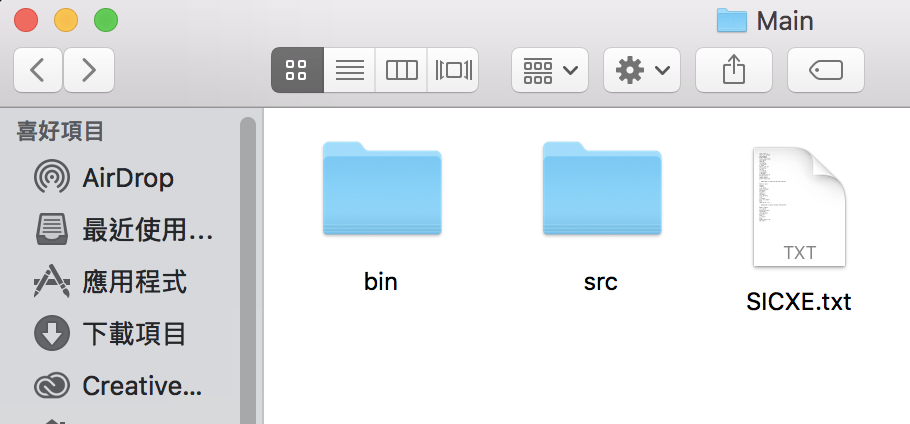
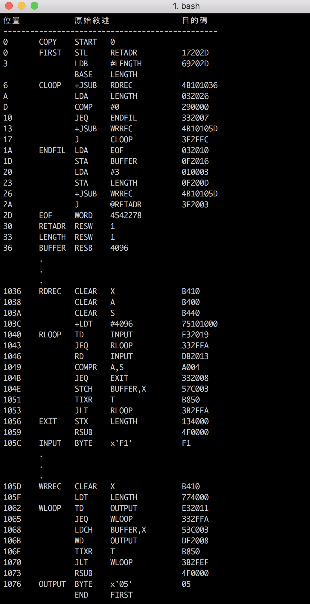

# SIC/XE Assembler

## SIC/XE機器架構
1. 記憶體 : 1 Mega bytes = 2 ^ 20
2. 用來表示記憶體位址之位元數為 20 bits
- 暫存器：（九種 每個24bits除浮點運算為48bits）
  - A (Accumulator) 累加器：算術運算
  - X (Index register) 索引暫存器：定址
  - L (Linkage register) 連結暫存器：跳到副程式JSUB，儲存返回位置
  - PC (Program counter) 程式計數器：儲存下一個要被執行的位置
  - SW (Status word) 狀態字組 
  - B (Base register) 基底暫存器
  - S、T (一般用途)
  - F (Floating point accumulator) 浮點運算 48 bits

  ## Usage
將此專案clone下來後有兩個執行方法

方法1.
-  利用Eclipse執行
- 注意SIC.txt檔案路徑位置放置於src的上一層資料夾才能正確執行



方法2.
- 利用終端機執行

    編譯java檔產出SICXE.class
  ```
  $ javac SIC.java 
  ```
    執行SIC應產出 SICXE_Final.txt

  ```
  $ java SICXE
  ```

- 注意SICXE.txt檔案路徑位要與java放一起才能正確執行



## License
```
Copyright (c) 2017 Yi Lin Tsai 

Permission is hereby granted, free of charge, to any person obtaining a copy
of this software and associated documentation files (the "Software"), to deal
in the Software without restriction, including without limitation the rights
to use, copy, modify, merge, publish, distribute, sublicense, and/or sell
copies of the Software, and to permit persons to whom the Software is
furnished to do so, subject to the following conditions:

The above copyright notice and this permission notice shall be included in all
copies or substantial portions of the Software.

THE SOFTWARE IS PROVIDED "AS IS", WITHOUT WARRANTY OF ANY KIND, EXPRESS OR
IMPLIED, INCLUDING BUT NOT LIMITED TO THE WARRANTIES OF MERCHANTABILITY,
FITNESS FOR A PARTICULAR PURPOSE AND NONINFRINGEMENT. IN NO EVENT SHALL THE
AUTHORS OR COPYRIGHT HOLDERS BE LIABLE FOR ANY CLAIM, DAMAGES OR OTHER
LIABILITY, WHETHER IN AN ACTION OF CONTRACT, TORT OR OTHERWISE, ARISING FROM,
OUT OF OR IN CONNECTION WITH THE SOFTWARE OR THE USE OR OTHER DEALINGS IN THE
SOFTWARE.
```
